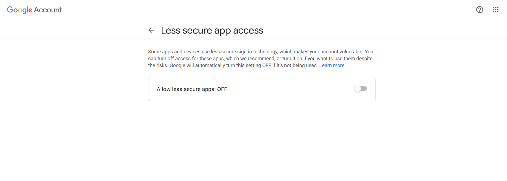
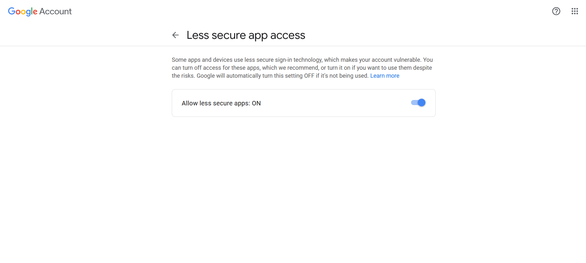

[](https://ankushsinghgandhi.github.io)
<p align="center">
  <a href="https://ankushsinghgandhi.github.io">
    
  </a>
  <a href="http://twitter.com/ankushsgandhi">
    
  </a>
   <a href="https://www.linkedin.com/in/ankush-singh-gandhi-2487771aa/">
    
  </a>
  <a href="https://dev.to/@ankushsinghgandhi">
    
  </a>
  <a href="https://stackoverflow.com/users/13790266/ankush-singh">
    
  </a>
  <a href="https://leetcode.com/ankushsinghgandhi/">
    
  </a>
    <a href="https://www.hackerrank.com/ankushsgandhi">
    
  </a>
</p>


# Bulk Mailer
## Send bulk mails all at once running Python Script which includes features like HTML mail, attach files and read contacts from excel.

<center>
<div>
    </img>
</div>
</center>

### How to use
- clone this repo
```
$ git clone https://github.com/swaaz/Bulk-Mailer.git
```

- change directory
```
$ cd Bulk-Mailer
```

- click on this [link](https://myaccount.google.com/lesssecureapps) and turn this option on as shown below




- open any editor of your choice and edit main.py
replace mailid and password
```
mailid   = "enter mail-id"
password = "password"
```
### Note: choose any one option depending upon your choice and delete other option
#### option-1: if you want to send mail with content
#### option-2: if you want to send HTML mail

### Attach files
if you need to attach files along wih this mail then paste all the files inside ```Bulk-Mailer/attachments/``` 

### Contacts
create a excel sheet named ```contacts.xlsx``` and name the coloumn as ```mail id``` and store all the mail id under that column
if you want to add mail id manually then replace this code snippet 
```
# reading mail id's from excel sheet
cont = pd.read_excel("contacts.xlsx")
contacts = cont['mail id'].values  #storing all the mail id's in contacts list
```
with this code
```
contacts = ['mailid1@gmail.com', 'mailid2@gmail.com']
```

### bugs
if you find any bugs then feel free to create issue and tag [@swaaz](https://github.com/swaaz/) 


#

<div align="center">

### Show some ❤️ by starring some of the repositories!

</div>
